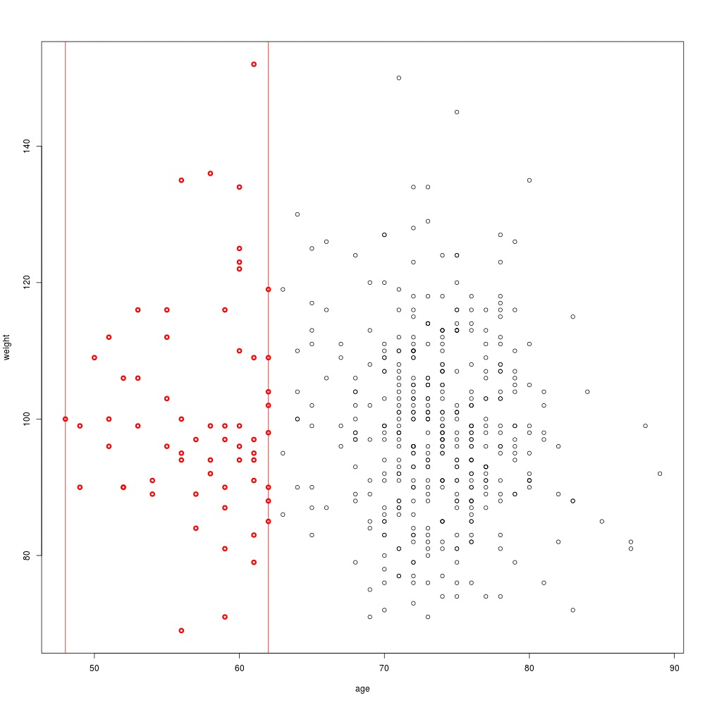
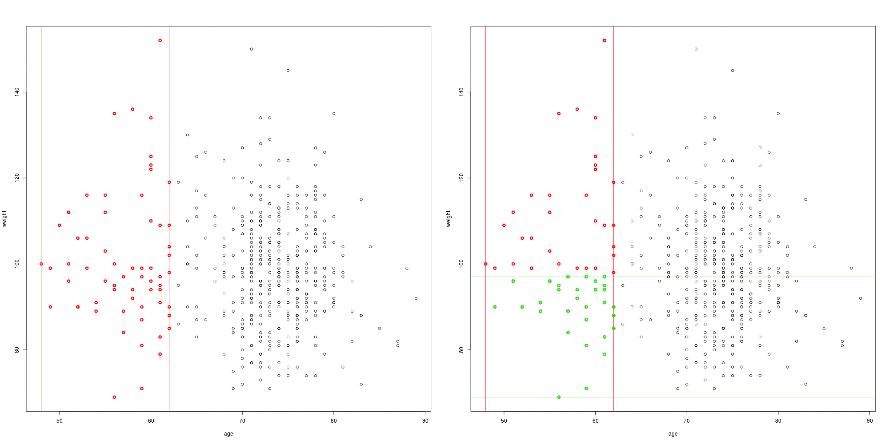

```{r setup, include=FALSE}
knitr::opts_chunk$set(echo = TRUE)
```

## Contour plot 1

we first form subgroups with a specified sample size 
  by neighbouring subjects in terms of their values on age and weight.
  For each subgroup, we calculate the hazard ratio for treatment vs. control, 
  and draw contour lines through a bivariate interpolation and smooth
  surface fitting for irregularly distributed data points at pre-specified
  grid points (loess).
  




# Contour plot 2

  We also propose using local regression 
  techniques to calculate the treatment effect at each coordinate. 
  In Figure~\ref{fig2}B, a weighted cox proportional hazard models is fitted 
  for each combination of weight and age (using a step of 1 unit). 
  A normal kernel with the centre at the coordinate values is used to assign weights to
  each subject. If there are less than 20 subjects within 2 standard deviations. the 
  effect size is not calculated and the area is left blank. This helps to avoid 
  extrapolating the results to areas in which we do not have enough information.
  
  

